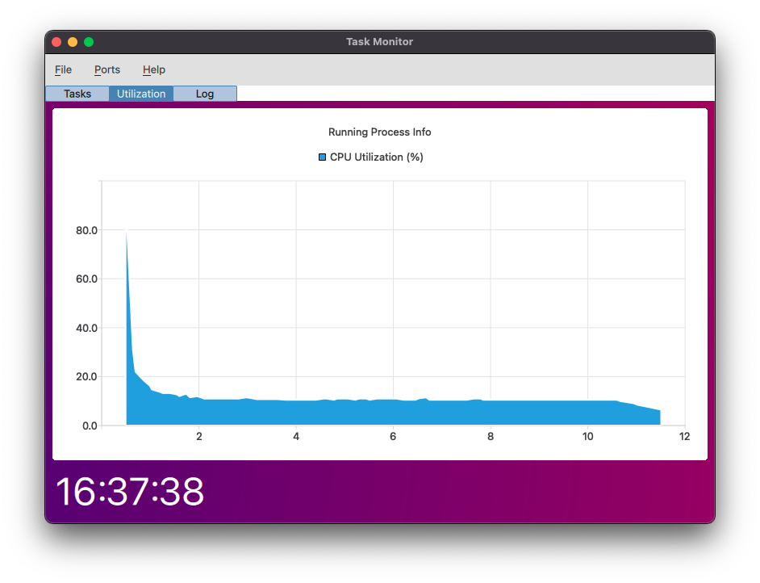
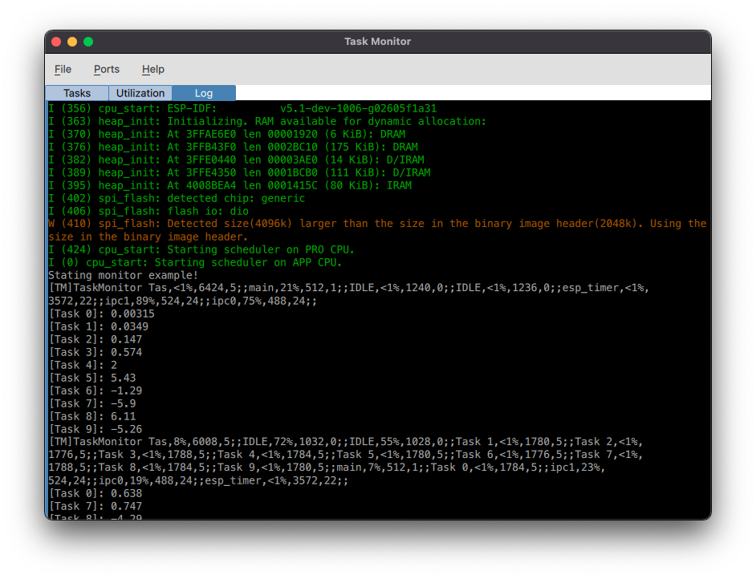
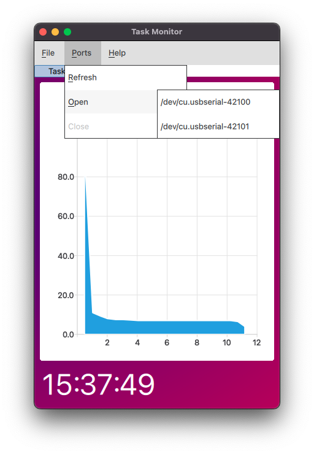

# task-monitor
GUI frontend for parsing and plotting performance logging output for esp-cpp

This app receives information from a running ESP32 system, which runs the
TaskMonitor component. The TaskMonitor component outputs usage in the form of:

> task name, cpu%, high_water_mark, priority;;

In a single line, prepended with `[TM]` and ending with a newline `\n`.

Example:

``` csv
[TM]TaskMonitor Tas,2%,6008,5;;IDLE,98%,1032,0;;IDLE,82%,1028,0;;Task 3,1%,764,5;;Task 8,1%,760,5;;Task 2,1%,752,5;;Task 1,1%,756,5;;Task 0,1%,760,5;;Task 7,1%,764,5;;Task 4,1%,488,5;;Task 5,1%,756,5;;Task 6,1%,480,5;;main,<1%,512,1;;Task 9,2%,756,5;;ipc0,1%,488,24;;esp_timer,<1%,3572,22;;ipc1,1%,524,24;;
```








Inspiration:
- [TaskManager-pyqt4](https://github.com/HighTemplar-wjiang/TaskManager-pyqt4)
- [pyqt-system-tool](https://github.com/lowstz/pyqt-system-tool)
- [SystemMonitorApp](https://github.com/earthinversion/SystemMonitorApp)
- [uart_serial_plotter](https://github.com/appliedinnovation/uart_serial_plotter)
